# CYD Classic Games

Classic games for the ESP32 "Cheap Yellow Display" family: touch-friendly,
portrait, built for a stylus on a resistive screen. Two-player games will
play CYD to CYD over WiFi (ESP-NOW, no router needed).

## WEB FLASHER!!!
I know you just want to flash this to your CYD right now, so here's the web flasher:
**[CYD Classic Games Web Flasher](https://tomtombombadil.github.io/CYD-Classic-Games/)**
(Chrome or Edge on a computer).

> **Status:** growing, built and tested on the PC preview; hardware testing
> under way. Thirty-one games and an RPG dice roller so far: **Sudoku** (from
> [CYD-Sudoku](https://github.com/tomtombombadil/CYD-Sudoku) v1.0.0),
> **Light Switch**, **Sliding Tiles**, **Minesweeper**, **MasterCYD**, **Peg Solitaire**, **Memory Match**, **Nonograms**, **2048**, **Solitaire**, **Spider**, **Pyramid**, **Golf**, **FreeCell**, **Blackjack**, **Video Poker**, **Texas Hold'em**, **FourConnect**, **Tic-Tac-Toe**,
> **Reversi**, **Checkers**, **Chess**, **Mancala**, **Nine Men's Morris**, **You Sank My CYD!**, **Ultimate Tic-Tac-Toe**, **Gomoku**, **CYD-dle**, **Wheel of CYD**, **Yaht-CYD**, **Farkle** and **RPG Dice**.
> More are on the way; see [docs/SPEC.md](docs/SPEC.md) for the plan.


## Screenshots

**2.8" and 3.2" boards (240×320)**: the game picker, the Strategy Games
page, Sudoku and its menu, Chess (and a tap showing where a piece can
go), Checkers, Reversi, FourConnect, Tic-Tac-Toe, Mancala, Nine Men's Morris, You Sank My CYD!, Ultimate Tic-Tac-Toe, Gomoku, CYD-dle, Wheel of CYD (and its wheel), Yaht-CYD, Farkle,
RPG Dice (a roll of every die, and a fighter's attacks preset), Minesweeper, MasterCYD, 2048, Peg Solitaire, Memory Match, Nonograms, Solitaire (and its win show), Spider, Pyramid, Golf, FreeCell, Blackjack, Video Poker, Texas Hold'em, a How To Play page, Sliding Tiles, Light Switch, Settings and the custom theme editor.

<p>


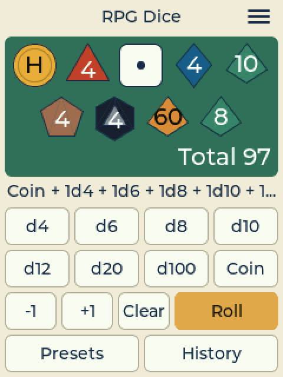
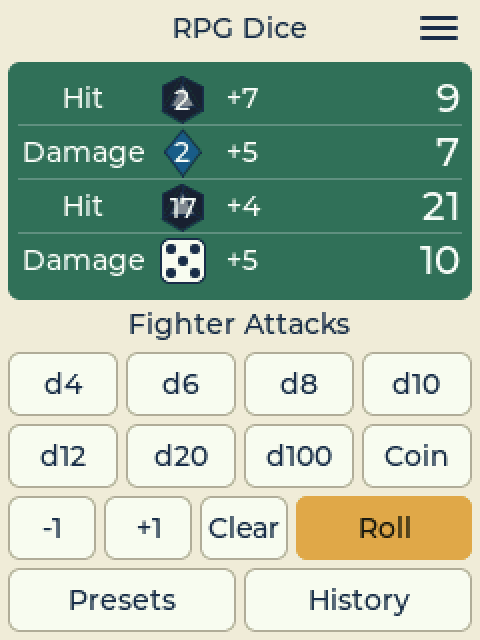


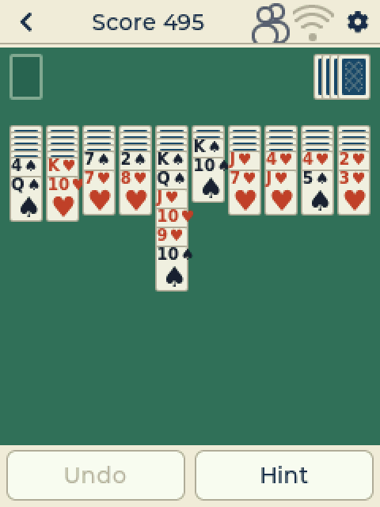
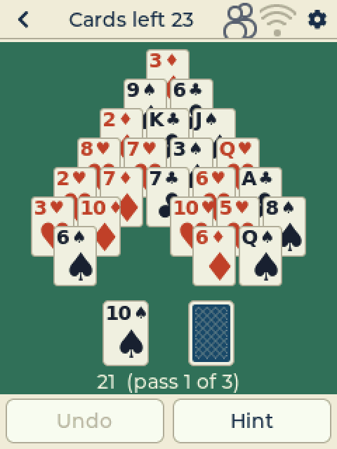
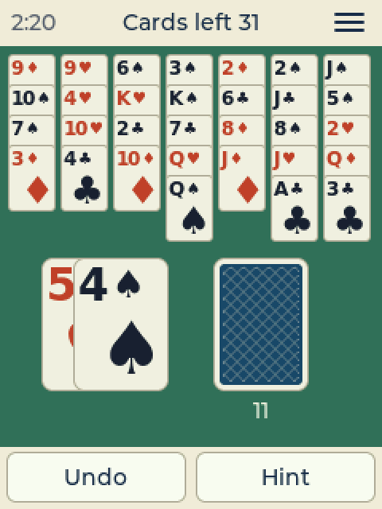
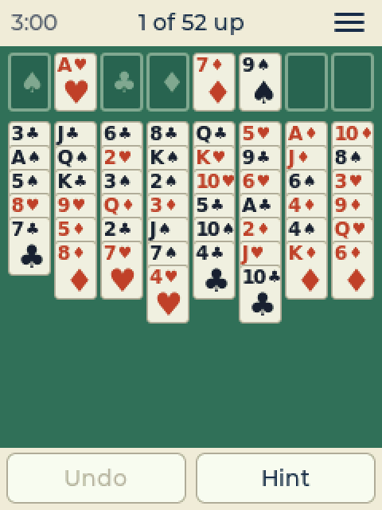
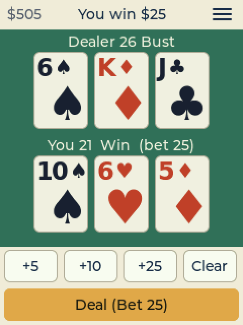
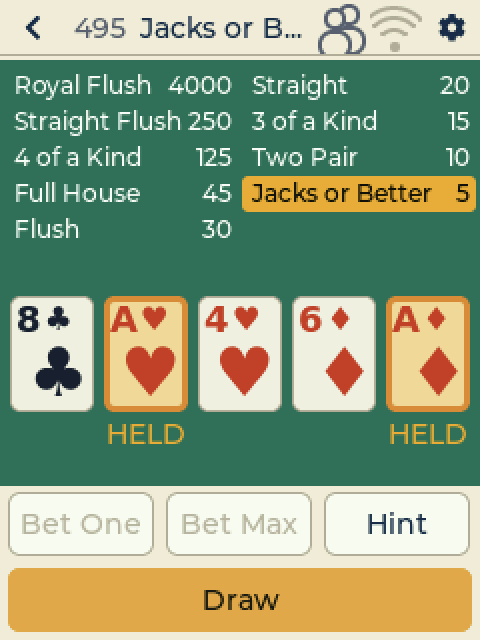
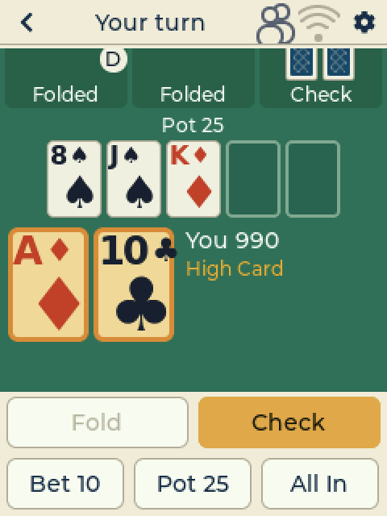
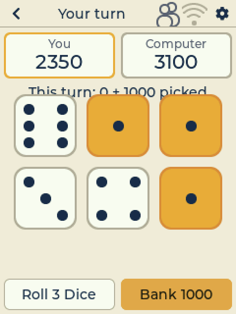
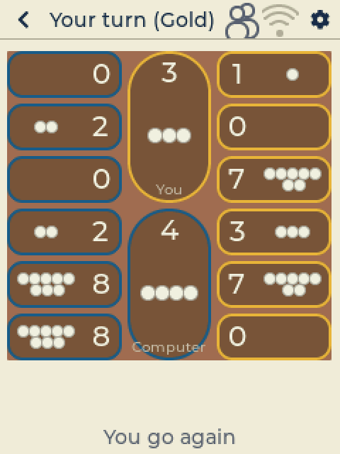
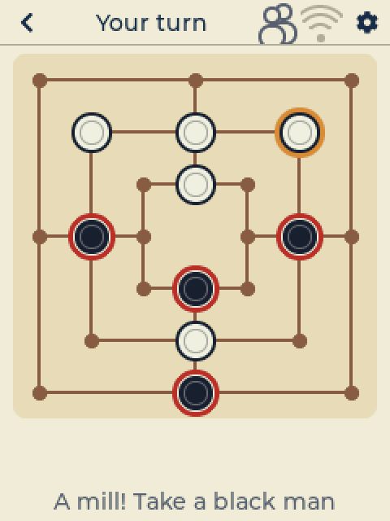
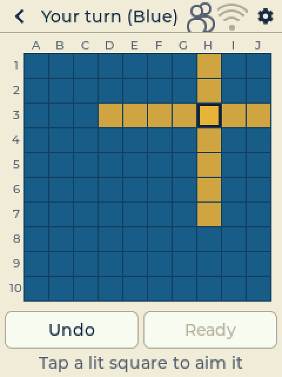
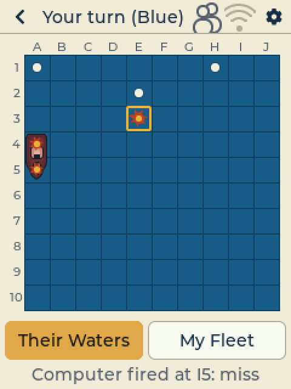
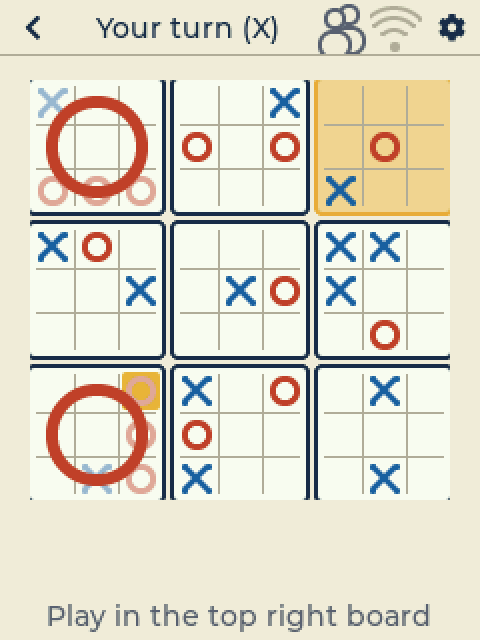
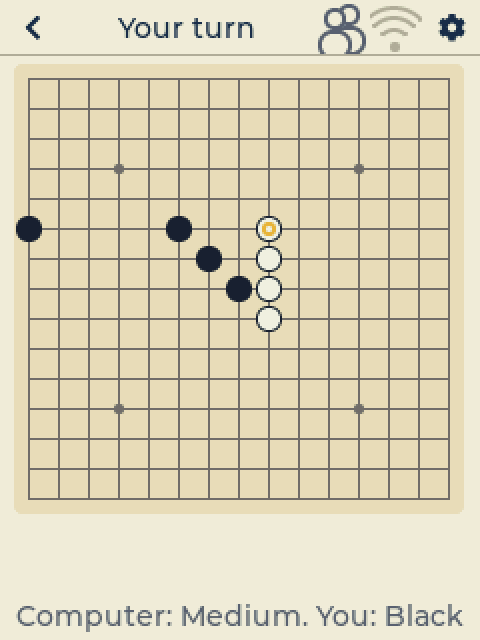
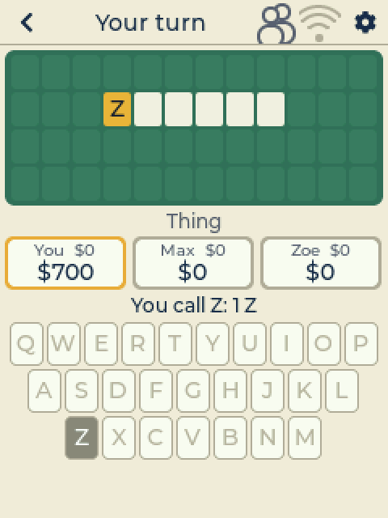
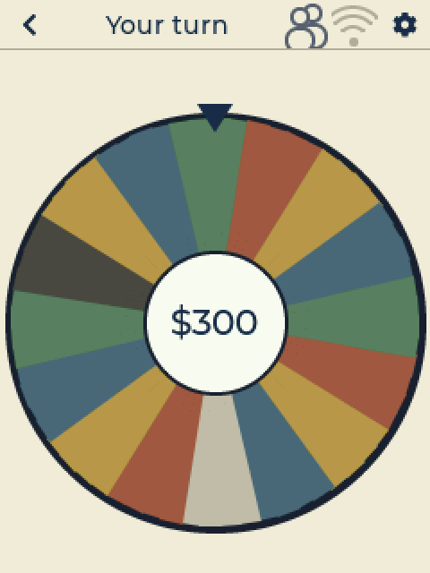


</p>

**3.5" and 4.0" boards (320×480)**: the picker, Chess, CYD-dle and Yaht-CYD
(dark theme), the two-player menu, Reversi and a lost Minesweeper board.

<p>


</p>

## Games

| Game | Category | Play |
|---|---|---|
| Sudoku | Puzzle Games | Solo, four levels graded by solving technique |
| Light Switch | Puzzle Games | Solo, Easy / Medium / Hard, with par and hints |
| Sliding Tiles | Puzzle Games | Solo, 3x3, 4x4 (the 15-Puzzle) or 5x5 |
| Minesweeper | Puzzle Games | Solo, Easy / Medium / Hard, never needs a guess |
| MasterCYD | Puzzle Games | Solo, crack a color code in 10 guesses: Easy / Normal / Hard |
| Peg Solitaire | Puzzle Games | Solo, Triangle / English / European boards, unlimited undo |
| Memory Match | Puzzle Games | Solo, 4x4 / 4x5 / 5x6 tiles, fewest turns |
| Nonograms | Puzzle Games | Solo, 5x5 / 8x8 / 10x10, solvable line by line |
| 2048 | Puzzle Games | Solo, tap toward a side to slide; reach the 2048 tile |
| Chess | Strategy Games | vs computer (Easy / Medium / Hard) or pass-and-play |
| Mancala | Strategy Games | Kalah, six pits a side, sown seed by seed; vs computer or pass-and-play |
| Nine Men's Morris | Strategy Games | Place, move and fly; mills take men; vs computer or pass-and-play |
| Ultimate Tic-Tac-Toe | Strategy Games | Nine boards in one; vs computer (Easy / Medium / Hard) or pass-and-play |
| Gomoku | Strategy Games | Five in a row on 15x15; vs computer (Easy / Medium / Hard) or pass-and-play |
| You Sank My CYD! | Strategy Games | Hide a fleet, fire at theirs; vs computer (Easy / Medium / Hard) or pass-and-play |
| Checkers | Strategy Games | vs computer (Easy / Medium / Hard) or pass-and-play |
| Reversi | Strategy Games | vs computer (Easy / Medium / Hard) or pass-and-play |
| FourConnect | Strategy Games | vs computer (Easy / Medium / Hard) or pass-and-play |
| Tic-Tac-Toe | Strategy Games | vs computer (Hard never loses) or pass-and-play |
| Solitaire | Card Games | Klondike: Draw 1 or 3, Standard / Vegas / no scoring, undo, hints |
| Spider | Card Games | 1, 2 or 4 suits, Windows scoring, undo, hints |
| Pyramid | Card Games | Pairs that make 13, three passes through the stock |
| Golf | Card Games | Clear the columns one rank up or down |
| FreeCell | Card Games | All cards face up, four free cells, nearly every deal winnable |
| Blackjack | Card Games | You against the dealer: hit, stand, double, split; 3 to 2 blackjacks |
| Video Poker | Card Games | Jacks or Better, full-pay table, bet 1 to 5 credits, Hint |
| Texas Hold'em | Card Games | No-limit, you against three computer players: Easy / Medium / Hard |
| CYD-dle | Word Games | Solo, guess the five-letter word: Easy / Normal / Hard |
| Wheel of CYD | Word Games | Spin, call letters, solve the phrase; you against two computer players (Easy / Medium / Hard) or pass-and-play |
| Yaht-CYD | Dice Games | Solo, five dice, 13 boxes, beat your best score |
| Farkle | Dice Games | Push-your-luck dice to 10,000, vs computer (Easy / Medium / Hard) or pass-and-play |
| RPG Dice | Dice Games | Every role-playing die, each shown as rolled; presets and history |

The board games (Chess, Checkers, Reversi, FourConnect, Tic-Tac-Toe,
Mancala, Nine Men's Morris, You Sank My CYD!, Ultimate Tic-Tac-Toe, Gomoku) also play **wireless, CYD to CYD**: two boards
in the same room or house, no router or setup (see
[Wireless play](#wireless-play-cyd-to-cyd)). The plan is in
[docs/SPEC.md](docs/SPEC.md).

## Starting up and the game picker

The board shows one of three title screens (a different one each time it
starts). Tap anywhere to go on to the game picker.

- **Continue** (the yellow card) reopens the last game you played, where you
  left off, in one tap. It shows how far along that game is.
- Below it, the categories: **Puzzle Games, Strategy Games, Card Games,
  Word Games, Dice Games**, each with how many games it has. Tap one to see its
  games as icons, and tap a game to play. Categories without games yet say
  "soon".

**The header bar** runs along the top of every screen, the games too:

- **<** (top left) goes back: closes a page, leaves a category, or leaves a
  game (saved for Continue). In a wireless game that is still going it
  asks first: leaving forfeits.
- In the middle: the page's name, or in a game just what matters now
  ("Your turn", "Score 45", "Solved!"). Sudoku and Minesweeper show their
  clock; Blackjack and Video Poker your chips.
- **2P** (two people): filled while a wireless game is going or saved until
  the boards meet again; tap it to go back to that game (or the Play page).
- **Wifi**: empty while wireless play is off (1P); a dot and up to three
  arcs for the signal of the boards nearby. Tap it for Play settings.
- **Gear** (top right): Settings - and in a game, the game's menu (New
  Game, Restart, How To Play, Stats, Settings...). Every game's menu ends
  with **Exit Menu** (bottom left, back to the game) and **Exit Game**
  (bottom right, saves the game and comes back here).

Every game has **How To Play** in its menu: a few short pages on the
idea, the rules and how its screen works. Every game saves itself and
keeps its own stats. Theme, sound, brightness
and touch calibration are shared.

## Settings

The **gear** (on the picker, or Settings in a game's menu) opens Settings:
**Display, Sound, Touch, Play, About**. The **<** in the header goes back.


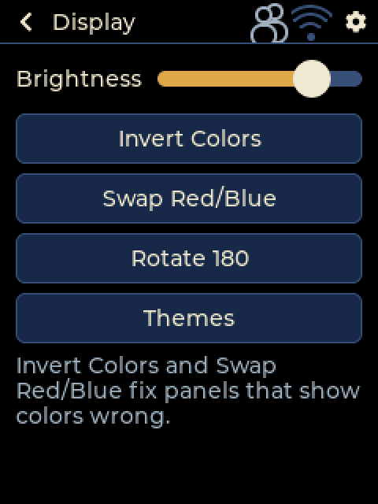
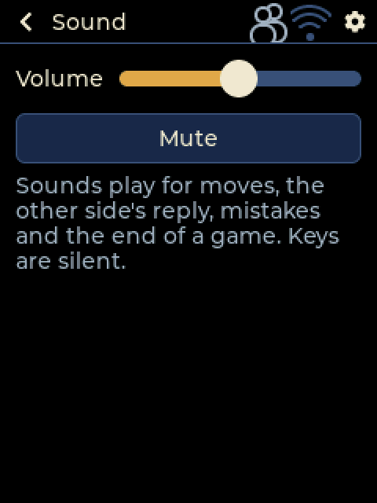

- **Display:** **Brightness**, **Invert Colors** and **Swap Red/Blue** (for
  panels that show colors wrong), **Rotate 180** (the picture and touch
  upside down, so the USB cord can leave either end; lit while on,
  remembered) and **Themes**: Light, Dark, or one of three **Custom**
  themes. Pick Custom 1, 2 or 3, then **Edit** it: each of the 10 color
  buttons (background, board, grid lines, text, your marks, selected,
  matching, row/column, buttons, accent) opens a palette of 48 colors. Tap
  one and the change shows at once, in every game. **Default** puts a color
  back; **Reset: Light / Dark** starts the theme over from Light or Dark.
- **Sound:** a **Volume** slider (it starts at 50 % - tiny speakers distort
  near the top; a sound plays at the new level when you let go) and
  **Mute** (lit while muted; tap again for the volume you had). Sounds come
  through a speaker on the board's speaker connector, and only for what
  matters in a game: moves, the computer's reply, mistakes, hints and the
  end of a game. Plain button taps are silent.
- **Touch:** **Touch Test** and **Recalibrate** (see below).
- **Play:** a switch between **Left Hand** and **Right Hand** (the hand
  that holds the stylus - the switch points at it). Games put what you tap
  most on that side (or along the bottom), so your hand doesn't cover the
  table: in Solitaire the stock sits in the top corner on your side with
  the waste just inside it and the foundations across from it; Golf,
  Pyramid and Spider put their stock on your side too, FreeCell its free
  cells, Mancala your pits, and Nonograms keep the row clues on the other
  side. Right Hand to start. Below it, **Play Mode: 1P | 2P** - 2P is
  wireless play, and its keys below (see [Wireless play](#wireless-play-cyd-to-cyd)).
- **About:** board, firmware, memory, uptime, the **Device Log** and **Send
  Log** (see [If the board crashes or misbehaves](#if-the-board-crashes-or-misbehaves)).

## Two-player games

Chess, Checkers, Reversi, FourConnect, Tic-Tac-Toe, Mancala, Nine
Men's Morris, You Sank My CYD!, Ultimate Tic-Tac-Toe and Gomoku share one menu: **New Game vs Computer** (Easy, Medium, Hard),
**Pass and Play** (two people share one board and take turns), and
**Wireless** (two boards: Wireless play, below). Farkle has the first two. Against the computer
you and the computer take turns going first, game by game. The computer
thinks on the board's second processor core, so the screen never freezes.
Its levels look ahead fewer or more moves (and think longer); it never
throws a game on purpose. Leaving a started game against the computer for a
new one counts as a loss.

- **Chess:** tap one of your pieces (dots show where it can go), then tap
  the square. Castling, en passant and promotion are all there; a pawn
  reaching the far side asks what it becomes. Checkmate, stalemate,
  threefold repetition, the 50-move rule and too little material all end
  the game. Easy looks 2 moves ahead, Medium 3 (up to 2 seconds), Hard up to
  6 (up to 6 seconds a move).
- **Checkers:** tap a piece, then where it lands. Jumps are compulsory, so
  when one is possible only the pieces that can jump respond. A double or
  triple jump is tapped one landing at a time. A piece reaching the far row
  is crowned and moves both ways.
- **Reversi:** your legal moves show as dots; tap one. If you have no move
  your turn passes. Hard plays the last 10 squares perfectly.
- **FourConnect:** tap anywhere in a column to drop a disc there. Four in a
  row (across, up or diagonal) wins; the four get a ring. A dot marks the
  last disc played.
- **Tic-Tac-Toe:** tap a square. Hard plays perfectly: the best you can do
  is a draw.
- **Seeing moves** (Chess and Checkers): tap one of your pieces and dots
  show where it can go; tap a dot to move. Tap one of the other side's
  pieces to see its moves; the next tap clears that.
- **Play Again** appears when a game ends.

## CYD-dle

Guess the five-letter word. Type a guess on the keyboard and tap ✓. Each
letter turns green (right letter, right spot), gold (in the word, wrong
spot) or grey (not in the word); the keyboard keeps track of every letter.
**Easy** gives 7 guesses, **Normal** 6, and **Hard** 6 where every green
and gold letter must be used in the next guesses. Guesses must be real
words. When the game is over, ✓ starts a new word. Stats keep your solves
and guess counts per level.

## RPG Dice

A dice roller for tabletop role-playing games: **Coin, d4, d6, d8, d10, d12,
d20 and d100**. Tap die keys to build a roll (three taps on d6 = 3d6),
**-1 / +1** for a modifier, then **Roll**. The roll is drawn as dice - a d4
triangle, d6 with pips, d8 diamond, d10 kite, d12 pentagon, d20 hexagon,
d100 as two d10s - each showing its number, with the total. A natural 20
glows gold, a natural 1 red. **Roll** again repeats it.

**Presets** roll up to four lines at once, each with a label (Hit,
Damage, Save...), dice and a modifier - for example a fighter's two
attacks: Hit d20+7, Damage d8+5, Hit d20+4, Damage d6+5 (that one is there
to start with). **Edit Presets** changes names, lines, dice and modifiers.
**History** keeps the last 40 rolls, newest first.

## Yaht-CYD

Five dice, 13 turns, the score card on top and the dice and **Roll** along
the bottom (so your hand stays off the card). Tap **Roll**, tap dice to hold them (held dice turn
gold) and roll again, up to three rolls. Then tap an empty box on the score
card: after each roll the empty boxes show what they would score.

- Upper boxes (Ones to Sixes) score the matching dice; 63 or more there
  earns a 35 bonus.
- 3 / 4 of a Kind (sum of all dice), Full House 25, Run of 4 30, Run of 5
  40, **Yaht-CYD** (five alike) 50, Chance (sum of all dice).
- Every extra Yaht-CYD after a scored 50 is worth 100 more and is a joker
  (it goes in its number's upper box if that's empty, otherwise anywhere,
  and Full House and the runs count in full).
- Stats keep every game's score, your best and your average.

## Minesweeper

Open every cell that isn't a mine. A number tells how many of the 8 cells
around it hide mines. Your first tap always opens an area, and every board
can be cleared by logic alone: you never have to guess.

- **Dig | Flag** under the board picks what a tap does: open a cell, or put
  a flag on a cell you know is a mine (tap again to take it off).
  **Long-press** a hidden cell to flag or unflag it in either mode.
- Tap a number whose mines are all flagged to open the rest of the cells
  around it.
- The top bar counts mines left (mines minus flags). Hitting a mine ends
  the game and shows where the mines were; a crossed-out flag was wrong.
- Easy 8x10 with 10 mines, Medium 9x11 with 15, Hard 10x11 with 20: sized so
  every cell is big enough for a stylus on the 2.8" boards.
- Stats: games won and lost per level, and your best time.

## MasterCYD

The board hides a code of colored pegs; crack it in 10 guesses. Tap a color
at the bottom to fill the next slot of your guess (tap a slot to empty it),
then **Check**. Next to each guess, a **filled dot** means a peg of the
right color in the right place, a **ring** a right color in the wrong place
(they don't say which pegs). The code shows at the top when the game ends.
Easy: 4 pegs, no color twice. Normal: 4 pegs, colors may repeat. Hard: 5
pegs. Stats keep wins, losses and best times per level.

## Peg Solitaire

Jump a peg over a neighbouring peg into the empty hole beyond it; the
jumped peg comes off. Finish with one peg. Tap a peg (the holes it can jump
to show as dots), then tap the hole. **Undo** takes back any number of
jumps, even after you're stuck. Boards: **Triangle** (15 holes, six jump
directions), **English** (the 33-hole cross) and **European** (37 holes,
starting with the hole two above the centre, since the centre start can't
be solved there). Every board's start is checked solvable by the tests.

## Memory Match

Every picture is on two face-down tiles; find all the pairs in as few
turns as you can. A pair stays up (green edge); a miss stays up with a red
edge until your next tap, which turns it back over and turns the tile you
tapped, so there's no waiting. 4x4, 4x5 or 5x6 tiles. Stats keep your best
time and fewest turns.

## Solitaire

Classic Klondike, and every deal can be won: each new deal is checked by a
built-in solver before you see it (the next one is found in the background
while you play). Build the four foundations up by suit from Ace to King
(they always go Spades, Hearts, Clubs, Diamonds, and you can drop a card
anywhere on that row);
on the seven columns cards go down in alternating colors and only a King
goes into an empty column. Tap a face-up card (and the cards on it) to pick
it up (it turns gold), then tap where it goes; double-tap a card to send it
to its foundation (or the first column that takes it). Tap the stock to turn
cards: it sits in the top corner on your stylus hand's side (Settings →
Right Hand / Left Hand), with the waste just inside it and the foundations
across the row, so your hand never covers the table. **Undo** and **Hint**
sit under the table. When every card is face
up the rest go up by themselves, and then the cards bounce off the table
like the old Windows Solitaire (tap to stop).

**Menu (gear) → Options:** Draw 1 or Draw 3 (default), Standard scoring, Vegas
scoring (a deal costs $52, each foundation card pays $5, the balance
carries over) or none, and the **Card Back** (12 designs, shared by every
card game; Blue Lattice to start). The card games are quiet while you play
and play a little tune when you win.

## Blackjack

You against the dealer (the house); no other players at the table. Bet with
+5 / +10 / +25, then **Deal**. **Hit**, **Stand**, **Double** (one more card,
bet doubled) or **Split** a pair into two hands. The dealer turns the hidden
card over when you're done and draws to 17, one card at a time. Blackjack
pays 3 to 2. Six-deck shoe. You start with 500 chips; run out and **New
Chips** gives you another 500.

## Video Poker

The classic **Jacks or Better** machine. **Bet One** sets 1 to 5 credits
(**Bet Max** bets 5 and deals at once). Tap the cards to keep - they say
**HELD** - then **Draw** replaces the rest, once. The pay table at the top
shows what each hand pays at your bet and lights up the one you hold. A pair
of Jacks or better pays; a Royal Flush pays 4000 at a 5-credit bet.
**Hint** holds what the standard strategy keeps. 500 credits to start.

## Wireless play (CYD to CYD)

Two boards play each other over the air (ESP-NOW): no router, no
passwords, no setup, as far as a house's walls allow. The players don't
need to see or talk to each other: the boards do the finding and asking.

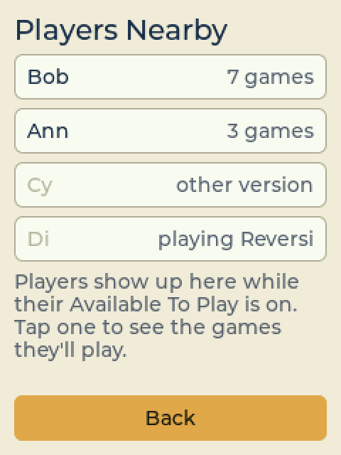
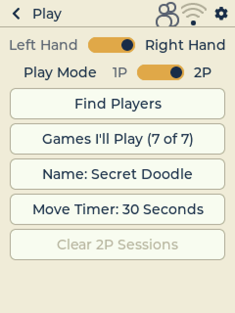
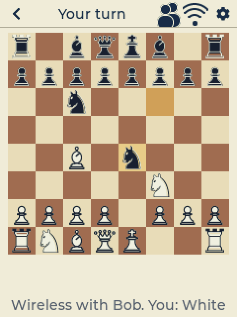
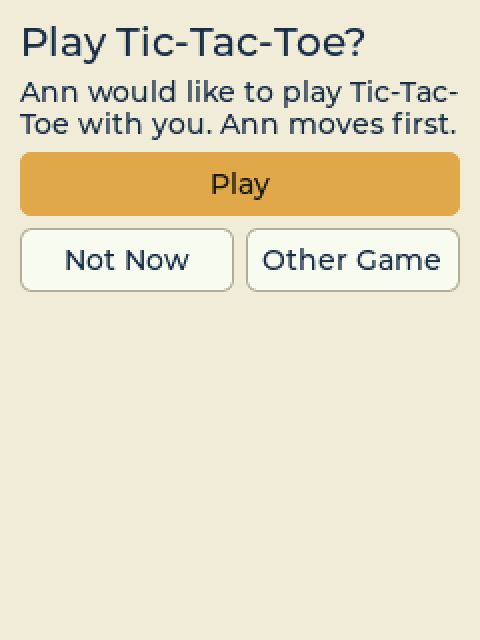
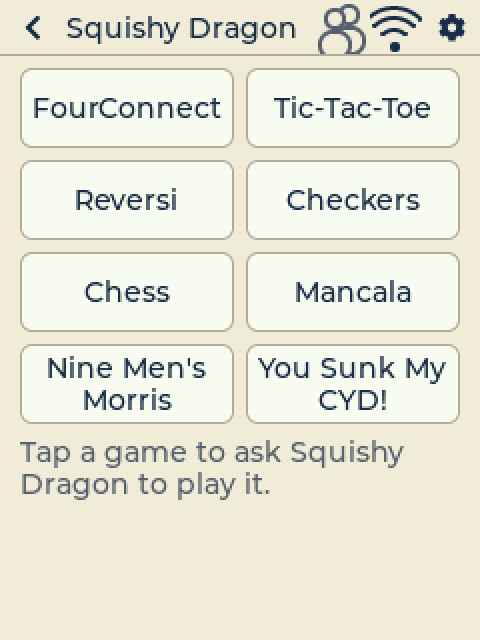
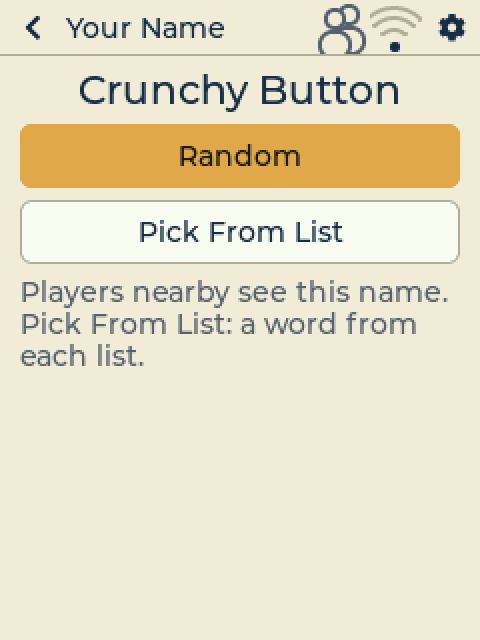

It all lives on the **Play** settings page: tap the **wifi icon** in the
header (or Settings → Play, or Wireless in a two-player game's menu).

**Nothing the players write or say ever travels between boards.** The
boards may be used by children, so there is no chat, no messages and no
typed names: only fixed codes go over the air (who's there, the games
offered, play requests and their fixed answers, moves).

- **Play Mode 2P**: the board listens and can be found by players who
  look. It stays quiet unless its player looks for others or is in a game,
  and while nothing is going on its radio dozes (awake a tenth of a second
  every 2 seconds) to save battery - being found or asked takes a second or
  two. Settings → About shows the radio's state.
  It stays on until you switch back to 1P, even after a restart.
- **Find Players** ("Searching..."): everyone nearby in 2P - "Bob -
  available", "busy" (in a game: can't be asked), "no games", "needs update"
  (Bob's board is older) or "later version" (this board is older; both say
  where to update: the web flasher). Tap a player to see the games: the ones
  you can both play are lit. Tap one to ask ("Requesting...").
- **Being asked** rings (a ding-dong) anywhere - the picker, a solo game, a
  menu: "Ann would like to play Chess." **Play**, **No Thanks** or **Other
  Game** (you pick one of Ann's games and ask her back). Ann sees "Bob said
  'no thanks'.", "Bob can't play right now.", "That game is no longer
  available.", "There was no answer from Bob." or "Bob went out of range."
  The first player to ask has priority.
- **Play**: "Connecting..." until both boards hear each other, a trill, and
  the game opens on both. The player who was asked moves first. A
  one-player game of the same game is put aside and comes back afterwards
  ("Resuming your previous one player game.").
- **Games I'll Play**: a key per game (lit = willing), and All Games.
- **Name**: two silly words, picked - never typed: **Random**, or **Pick
  From List** (a word from each of two lists). Players see only the name.
- **Move Timer**: 30 seconds (the default), 1, 2 or 5 minutes, or Off. The
  shorter of the two players' timers applies; you're told when it isn't
  yours. The header counts down: "Respond in 30s" / "Waiting... 30s". At 0:
  "You haven't responded in time. You will forfeit if you do not respond in
  10 seconds."
- **Clear 2P Sessions** ends a wireless game: a forfeit if the other player
  is connected and the game is going, else not counted on either board.

In the game:

- The other player's moves arrive by themselves, each checked against this
  board's own rules.
- **Leaving** (the header's **<** or Exit Game) asks first: "Leaving will
  forfeit this game." **Forfeit Game** in the menu acts at once. The other
  player sees "Bob left and forfeited the game."
- **Out of range**: "Waiting for Bob..." After a whole move time with
  nothing heard: "No reply from Bob. Do you want to close the game, or keep
  waiting?" **Close Game** = "Communications failed. Game not counted."
  **Keep Waiting** waits one more move time, then the game is saved (also
  through a restart: an oops reboot doesn't end it) and the 2P icon stays
  lit. When the boards meet again both players get "Bob is back in range.
  Continue Chess?" - it goes on if both tap Continue.
- **Game over**: **Again** (the next game starts once both tapped it; the
  other player moves first), **New Game** (ask the same player for another
  game) or **Goodbye** (both boards go back to the Play page). No Forfeit
  once a game is over; draws only by the game's own rules.
- Finished games are recorded on both boards (Stats: the Wireless row).

## Mancala

Kalah, the classic Mancala: six pits a side, four seeds in each. Seeds go
round the board: down the left column into the bottom store, up the right
column into the top one. Your pits are the column on your stylus hand's
side (Settings), your store the one your side runs into. Tap one of
your pits: its seeds are sown one at a time (you see them go) along your
side, into your store, along the other side - never into the other store.
Last seed in your store: you go again. Last seed in an empty pit of yours:
it and the seeds opposite go to your store. When either side runs out, the
other side keeps what's left on its side; most seeds wins. vs Computer the
board turns so your pits are on your hand's side; pass and play puts Gold
there.

## Nine Men's Morris

Each side has nine men; White starts. First place them one a turn on any
empty point, then move them along the lines to a neighbouring empty point
(tap your man - dots show where it can go - then the point). Three in a
line is a mill: the men you may take get a red ring, tap one. A side down
to three men may fly to any empty point. Two men left, or no move, loses.

## You Sank My CYD!

The classic ships-and-shots game. Each side hides a fleet in a 10 x 10
sea: Carrier (5), Battleship (4), Cruiser (3), Submarine (3) and Destroyer
(2), across or down; ships may touch but not overlap. Place your fleet
biggest ship first: tap the square where one end goes, then one of the lit
squares the way it should point (**Undo** takes one back), then **Ready**.
Options in the menu switches Ship Placement to Random: **Shuffle** until
you like it. Then take turns firing: **Their Waters** is the sea you fire
at (tap a square; white peg = miss, red = hit, a sunk ship shows), **My
Fleet** shows your ships and their shots. Sink the whole fleet to win. In pass-and-play the board asks to be
passed and waits for **Ready**, so nobody sees the other sea. The computer:
Easy fires at random and tries round a hit, Medium fires on a spaced
pattern and follows a line of hits, Hard works out where the ships left
can still lie (about 62 / 50 / 45 shots to sink a fleet).

## Ultimate Tic-Tac-Toe

Nine small tic-tac-toe boards make one big board. Win a small board with
three in a row; win the game with three small boards in a row. X starts
anywhere; after that, the square you pick sends the other player to the
small board in the same place (play a top right square, and they must play
in the top right board). If that board is won or full, they may play in
any open board. The board(s) you may play in are lit, and the line under
the board says where. The computer looks 2 / 4 moves ahead, or thinks
about a second on Hard.

## Gomoku

Five in a row on a 15x15 board. Black places first; then take turns
placing a stone on any empty point. Five or more in a line - across, down
or diagonal - wins. The last stone has a gold ring. The computer: Easy
plays its own lines and blocks only a five, Medium and Hard look 4 and 6
moves ahead among the most promising points.

## Wheel of CYD

Solve the hidden phrase before Max and Zoe, the computer players (or play
a friend: Pass and Play). Three rounds, a new puzzle each, its category
under the board. On your turn: **Spin** - the wheel fills the screen and
stops on a money wedge (pick a consonant; each one in the puzzle pays that
much and you go again), **BUST** (this round's money is gone, and your
turn) or **SKIP** (lose your turn); **Vowel** - buy one for $250; **Solve**
- tap letters into the blanks (the gold tile is next), then Solve. Solving
banks your round money (at least $500); the others lose theirs. Most money
banked after three rounds wins. Called letters go grey on the keyboard. The
502 puzzles in 11 categories were written for this project and are all
kid-safe (`assets/wheel/phrases.txt`).

## Farkle

Push your luck with six dice, against the computer or pass-and-play. Tap
the scoring dice to set them aside (they turn gold), then **Roll** the rest
or **Bank** the turn's points. A roll that scores nothing is a **Farkle**:
the turn's points are lost. Set all six aside and you roll all six again.
Scoring: a 1 = 100, a 5 = 50, three of a kind = 100 x the number (three 1s
= 1000), four / five / six of a kind 1000 / 2000 / 3000, a 1-6 straight or
three pairs 1500, four of a kind with a pair 1500, two triples 2500. First
to 10,000 wins; the other player gets one last turn to beat it.

## Texas Hold'em

No-limit Hold'em against three computer players (Ada, Max and Zoe), 1000
chips each, blinds 5 and 10. On your turn: **Fold**, **Check / Call**,
**Bet / Raise** (the smallest raise), **Pot** (bet the pot) or **All In**.
Your best hand so far shows next to your cards; at a showdown everyone still
in turns their cards over. All-ins make side pots. The computer players
estimate their chances by dealing the rest out hundreds of times (they never
see your cards) and each has a style: steady, tight or pushy. Easy, Medium
and Hard change how carefully they think.

## Spider, Pyramid, Golf and FreeCell

- **Spider:** two decks in ten columns. Build King-to-Ace runs in one suit;
  a full run comes off by itself, take off all eight to win. Any card goes
  on one a rank higher, but only same-suit runs move together. Tap the
  stock to deal a row (every column needs a card). Levels: 1, 2 or 4 suits.
- **Pyramid:** remove pairs of uncovered cards that add up to 13 (Ace 1,
  Jack 11, Queen 12; a King goes alone). The waste's top card pairs too;
  three passes through the stock.
- **Golf:** play a column's top card onto the waste if it's one rank higher
  or lower (no wrapping, nothing on a King); turn the stock when stuck.
- **FreeCell:** every card face up; four free cells hold one card each.
  Runs move together as far as the free spaces allow, and cards nothing
  else needs go up by themselves. Tap the free-cell row or the foundation
  row anywhere to drop a card there.

All four have **Undo** and **Hint**, the bouncing-cards win show, and a
**Card Back** key in their menu (the back is shared with every card game).

## Nonograms

Paint a hidden picture: the numbers beside each row and above each column
give the runs of filled cells in that line, in order. **Fill** fills a cell
(tap again to clear); **Mark** puts an X where you know nothing goes. A
clue turns grey when its line matches, and the row and column you last
tapped are tinted. Every puzzle has one answer and can be solved one line at
a time, no guessing. 5x5, 8x8 or 10x10.

## 2048

Slide the tiles so equal tiles meet and merge: 2 + 2 = 4, 4 + 4 = 8, and on
up to 2048 (then keep going for a higher score). After every slide a new 2
(sometimes a 4) appears; the newest tile has a dark ring. The game ends when
no slide can move anything.

No swiping on a resistive screen: **tap toward the side you want**. The
board's two diagonals, extended to the screen edges, split everything below
the top bar into four invisible zones: tap above the board to slide up,
below it to slide down, beside it to slide left or right (anywhere in a
zone works, on the board too). The top bar shows the score; under the board
are your best score and the move count. Stats keep every game played to the
end (and any game that reached 2048): best and average score, top tile.

## Light Switch

Tapping a light flips it and its four neighbours. Turn every light off. The
top bar shows your moves and **par**, the fewest presses that can solve this
board. **Hint** works like Sudoku's: the first tap outlines a light that is
part of a shortest solution, the second tap presses it.

## Sliding Tiles

Put the tiles in order with the gap last. Tap any tile in the gap's row or
column: it and the tiles between it and the gap slide over. Tiles already in
their home spot are tinted. 3x3 (Easy), 4x4 (the classic 15-Puzzle) and
5x5 (Hard).

## Sudoku

The screen, top to bottom: the header bar (the clock; the gear opens the menu); the board;
the tool row (**Undo**, **Notes**, input mode, **Hint**); the digits 1-9.

- **Input mode** — the third button shows the current mode; tap it to switch.
  Remembered between games. **Digit 1st** is the default.
  - **Digit 1st:** tap a digit, then tap cells to place it. Tap a cell that
    already holds that digit to clear it; a different digit is replaced.
    Tap a given (black) digit to pick that digit. Picking a digit clears the
    cell highlight. When the last of a digit is placed it greys out and is
    deselected.
  - **Cell 1st:** tap a cell, then a digit. Tap the same digit again to
    clear it.
- **Notes:** while on, digits add or remove pencil marks instead of answers.
  Placing a digit removes it from the notes in its row, column and box.
- **Undo** steps back one action. Undoing a placement also brings back the
  notes it cleared.
- **Hint:** the first tap points at a cell (the top bar says "Tap Hint to
  fill"); a second tap fills in the right digit, shown in green and locked.
  It points at your selected cell if that one is empty or wrong, else at a
  wrong entry if there is one, else at the easiest empty cell. Hints are
  counted in your stats.
- On the 3.5" and 4.0" boards the small number under each digit is how many
  of that digit are left to place. The 2.8"/3.2" boards leave it out so the
  board can be bigger.
- Clashing digits are tinted red. A digit button greys out once all nine are
  placed correctly.
- **The clock** only runs while you play. After 2 minutes with no touch it
  stops and the top bar says **Paused**; the next touch starts it again. It
  stops while a menu is open.
- **Solving** flashes the screen (colors invert a few times) and leaves the
  finished board on screen. Open the menu (the gear) when you're ready for a new game.
- **Menu (the gear):** new game (Easy, Medium, Hard, Expert), **Restart This
  Puzzle**, **Stats**, **Settings**, then **Exit Menu** | **Exit Game**.
  Buttons act on the first tap; nothing asks "are you sure".

### Difficulty

Every puzzle has exactly one solution, and its level is set by the hardest
solving technique it needs (checked by a built-in solver that works the way
a person does):

| Level | Needs | Never needs |
|---|---|---|
| Easy | naked and hidden singles only (36+ clues) | anything else |
| Medium | pointing / claiming (locked candidates) | pairs, triples, fish |
| Hard | naked/hidden pairs and triples, X-Wing | Swordfish, wings |
| Expert | Swordfish, XY-Wing or XYZ-Wing | chains or guessing |

No puzzle ever needs guessing. While Sudoku is open the board keeps two
puzzles of each level ready in the background, so new games start at once.

### Coming from CYD-Sudoku?

Flash this over CYD-Sudoku **without** erasing and your Sudoku game in
progress, stats, touch calibration, color fixes and settings carry over.

## Stats

Each game keeps its own history. For Sudoku: every solved puzzle with its
difficulty, time and hints used, and every puzzle you leave for a new game
after playing it (marked "Gave up"). The Stats screen shows solves, average
and best time per difficulty, and your most recent games. **Delete Last**
removes the most recent entry and **Clear All** wipes that game's history.
The puzzles record level, moves and time (best time and fewest moves per
level). Minesweeper and MasterCYD record wins, losses and best times, CYD-dle guesses per level and Yaht-CYD every
score. Two-player games record wins, losses and draws against each
computer level, and who won each pass-and-play game.

- **With a microSD card** (3.2", 3.5" and 4.0" boards): saved to
  `CYD-Classic-Games/<game>.csv` on the card (e.g. `sudoku.csv`), full
  history, opens in Excel. Anything recorded before the card went in is
  moved onto it.
- **Without a card**, and on the 2.8" boards for now: saved in the board's
  memory (the most recent 250 games per game). The 2.8" board's SD slot
  shares a controller with its touch screen and needs a driver change first.

## Install

**Easiest:** open the [web flasher](https://tomtombombadil.github.io/CYD-Classic-Games/)
in Chrome or Edge, plug in the board, pick it from the list and click Install.

Or download the `.bin` for your board from [Releases](../../releases) and
flash it at address **0x0** with Espressif's Flash Download Tool.

## Supported boards

Boards are named by screen size, display driver and touch type. Check the
text printed on the back of the board. The `TTB-CYD-CG_` prefix marks the
file as CYD Classic Games.

| Firmware file | Printed on the back | Tested |
|---|---|---|
| `TTB-CYD-CG_2.8in_ILI9341_Resistive.bin` | ESP32-2432S028 (often with R) — usually single micro-USB | Yes |
| `TTB-CYD-CG_2.8in_ST7789_Resistive.bin` | ESP32-2432S028 (often with R) — usually micro-USB + USB-C | Yes |
| `TTB-CYD-CG_3.2in_ST7789_Resistive.bin` | 3.2" LCD Display, ESP32-32E, 240x320, Resistive Touch | Yes |
| `TTB-CYD-CG_3.5in_ST7796_Resistive.bin` | 3.5" LCD Display, ESP32-32E, 320x480, Resistive Touch | Yes |
| `TTB-CYD-CG_4.0in_ST7796_Resistive.bin` | 4.0" LCD Display, ESP32-32E, 320x480, Resistive Touch | Yes |

Not sure which 2.8" you have? Try ILI9341 first. Wrong colors: see below.
Garbled or blank screen: install the other 2.8" version.

## Building (Windows, VS Code + PlatformIO)

1. Install VS Code and the **PlatformIO IDE** extension.
2. Clone this repo and open the folder in VS Code.
3. In the blue status bar, click the `env:` selector and choose your board
   (e.g. `cyd32_st7789_res` for the 3.2" ST7789 board).
4. Click **Build** (✓), then **Upload** (→) with the board plugged in.
5. **Serial Monitor** (plug icon) shows boot logs at 115200 baud.

## Brightness

**Settings → Display → Brightness** sets the backlight. It never goes fully
dark, and it's remembered.

## Touch calibration

On first boot (or when the **BOOT** button is held while powering on), the
screen shows corner arrows — tap each tip precisely. The calibration is saved
to flash and reused. To redo it: **Settings → Touch → Recalibrate**.

## If the board crashes or misbehaves

The board keeps a small log: each start, why it last restarted (power on,
crash, watchdog, power dip) and, after a crash, a short crash report. Read
it on the board under **Settings → About → Device Log** (pages
with < >; newest at the end). Boards with a working SD slot also keep a
copy at `/CYD-Classic-Games/log.txt` whenever a card is in (**Copy To SD**
does it on demand).

**Sending the log to the developer** - either way opens a page with the log
and an **Email the Log** button (to cyd.classic.games.logs@gmail.com):

- **Phone:** **Settings → About → Send Log** shows the log
  (compressed, the newest few hundred lines) as a QR code. Point the phone's
  camera at it.
- **Computer (Chrome or Edge):** plug the board in and use **Read Log Over
  USB** on the [log page](https://tomtombombadil.github.io/CYD-Classic-Games/l/)
  (linked from the installer page). This reads the whole log.

Or plug the board into a PC and open PlatformIO's **Serial Monitor** (plug
icon, 115200 baud): every log line shows there as it happens, and typing
`log` prints the whole log (it also answers while the splash screen waits
for its tap). With the PlatformIO project open, crash
backtraces are decoded right in the monitor.

A crash report's backtrace is a list of addresses. To turn them into
function names for a downloaded build, use the matching `firmware.elf`
(Actions → the build → artifact `elf-<board>`, or `debug-symbols.zip` on a
release) in PowerShell:

```powershell
& "$env:USERPROFILE\.platformio\packages\toolchain-xtensa-esp-elf\bin\xtensa-esp32-elf-addr2line.exe" -pfiaC -e firmware.elf 0x400d8f3c 0x400d9122
```

## Colors look wrong?

Panels vary between production runs. Open **Settings → Display**: use
**Invert Colors** if colors look like a photo negative, and **Swap Red/Blue**
if blue shows as red. The fix is saved on the board.
For a dark screen on purpose, use **Theme: Dark** instead.

## License

[MIT](LICENSE). Third-party components and what may be borrowed from where:
[THIRD_PARTY_NOTICES.md](THIRD_PARTY_NOTICES.md).
