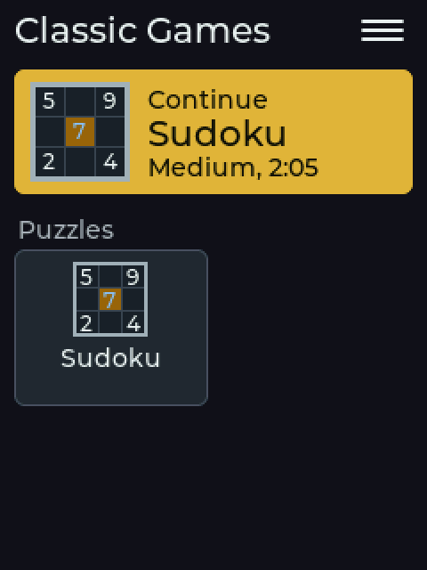
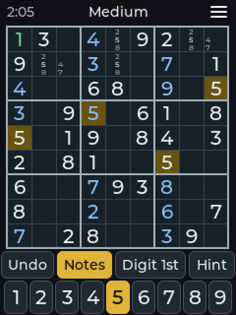
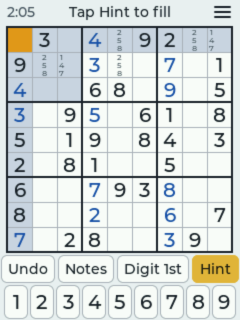
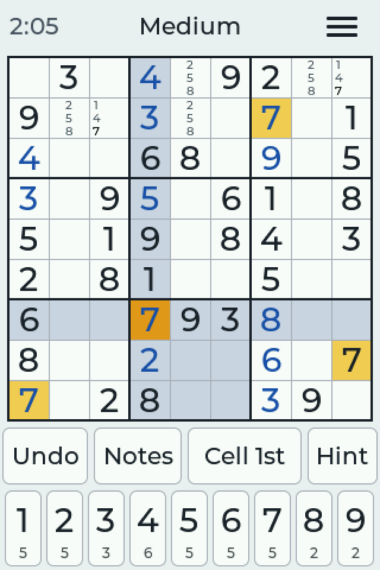
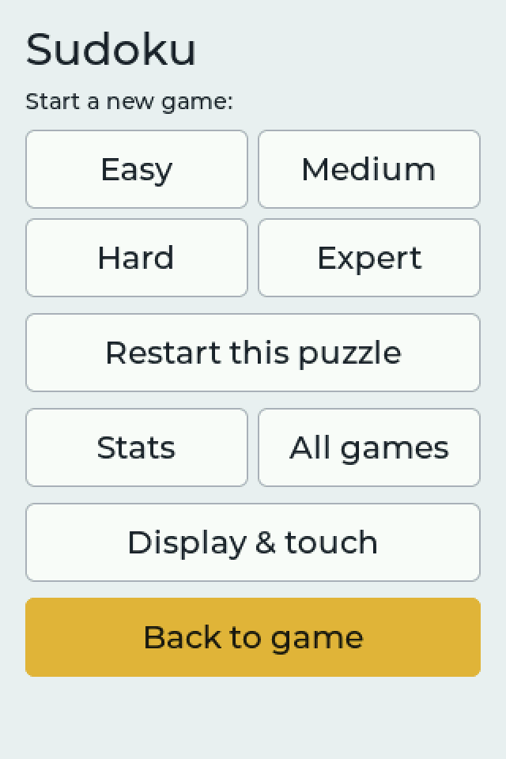
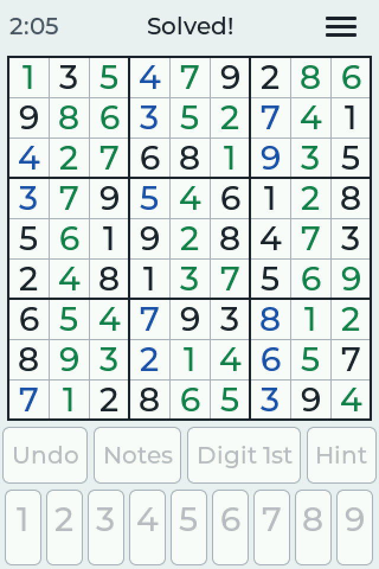
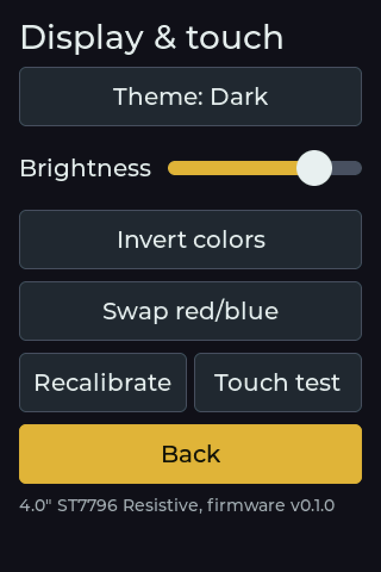

# CYD Classic Games

Classic games for the ESP32 "Cheap Yellow Display" family: touch-friendly,
portrait, built for a stylus on a resistive screen. Two-player games will
play CYD to CYD over WiFi (ESP-NOW, no router needed).

## WEB FLASHER!!!
I know you just want to flash this to your CYD right now, so here's the web flasher:
**[CYD Classic Games Web Flasher](https://tomtombombadil.github.io/CYD-Classic-Games/)**
(Chrome or Edge on a computer).

> **Status:** early. The game picker is in and **Sudoku** (from
> [CYD-Sudoku](https://github.com/tomtombombadil/CYD-Sudoku) v1.0.0) is the
> first game. More are on the way; see [docs/SPEC.md](docs/SPEC.md) for the
> plan.

## Screenshots

**2.8" and 3.2" boards (240×320)**: the game picker (light and dark), Sudoku,
Digit 1st with notes (dark theme), a hint pointing at a cell, Sudoku's ☰ menu.

**3.5" and 4.0" boards (320×480)**: the game picker, Sudoku (with
digits-left counts), its menu, stats, a solved puzzle, Display & touch (dark
theme).

## Games

| Game | Category | Play |
|---|---|---|
| Sudoku | Puzzles | Solo, four levels graded by solving technique |

Coming next (proposed order in [docs/SPEC.md](docs/SPEC.md)): quick games
like Lights Out, Tic-Tac-Toe, the 15-Puzzle and Four in a Row, then Othello,
Checkers and Chess against the computer, pass-and-play and CYD to CYD.

## The game picker

The board starts on the game picker.

- **Continue** (the yellow card) reopens the last game you played, where you
  left off, in one tap. It shows how far along that game is.
- Below it, every game as a tile, grouped by category. Tap one to play it.
  When there are more games than fit, big **<** and **>** buttons at the
  bottom switch pages.
- **☰ menu:** Display & touch (theme, brightness, color fixes, touch
  calibration), shared by every game.
- Inside a game, **☰ → All games** saves the game and comes back here.

Every game saves itself and keeps its own stats. Theme, brightness and
touch calibration are shared.

## Sudoku

The screen, top to bottom: clock, difficulty and the **☰ menu**; the board;
the tool row (**Undo**, **Notes**, input mode, **Hint**); the digits 1-9.

- **Input mode** — the third button shows the current mode; tap it to switch.
  Remembered between games. **Digit 1st** is the default.
  - **Digit 1st:** tap a digit, then tap cells to place it. Tap a cell that
    already holds that digit to clear it; a different digit is replaced.
    Tap a given (black) digit to pick that digit. Picking a digit clears the
    cell highlight. When the last of a digit is placed it greys out and is
    deselected.
  - **Cell 1st:** tap a cell, then a digit. Tap the same digit again to
    clear it.
- **Notes:** while on, digits add or remove pencil marks instead of answers.
  Placing a digit removes it from the notes in its row, column and box.
- **Undo** steps back one action. Undoing a placement also brings back the
  notes it cleared.
- **Hint:** the first tap points at a cell (the top bar says "Tap Hint to
  fill"); a second tap fills in the right digit, shown in green and locked.
  It points at your selected cell if that one is empty or wrong, else at a
  wrong entry if there is one, else at the easiest empty cell. Hints are
  counted in your stats.
- On the 3.5" and 4.0" boards the small number under each digit is how many
  of that digit are left to place. The 2.8"/3.2" boards leave it out so the
  board can be bigger.
- Clashing digits are tinted red. A digit button greys out once all nine are
  placed correctly.
- **The clock** only runs while you play. After 2 minutes with no touch it
  stops and the top bar says **Paused**; the next touch starts it again. It
  stops while a menu is open.
- **Solving** flashes the screen (colors invert a few times) and leaves the
  finished board on screen. Open the ☰ menu when you're ready for a new game.
- **☰ menu:** new game (Easy, Medium, Hard, Expert), restart, **Stats**,
  **All games**, and **Display & touch**. Buttons act on the first tap;
  nothing asks "are you sure".

### Difficulty

Every puzzle has exactly one solution, and its level is set by the hardest
solving technique it needs (checked by a built-in solver that works the way
a person does):

| Level | Needs | Never needs |
|---|---|---|
| Easy | naked and hidden singles only (36+ clues) | anything else |
| Medium | pointing / claiming (locked candidates) | pairs, triples, fish |
| Hard | naked/hidden pairs and triples, X-Wing | Swordfish, wings |
| Expert | Swordfish, XY-Wing or XYZ-Wing | chains or guessing |

No puzzle ever needs guessing. While Sudoku is open the board keeps two
puzzles of each level ready in the background, so new games start at once.

### Coming from CYD-Sudoku?

Flash this over CYD-Sudoku **without** erasing and your Sudoku game in
progress, stats, touch calibration, color fixes and settings carry over.

## Stats

Each game keeps its own history. For Sudoku: every solved puzzle with its
difficulty, time and hints used, and every puzzle you leave for a new game
after playing it (marked "Gave up"). The Stats screen shows solves, average
and best time per difficulty, and your most recent games. **Delete last**
removes the most recent entry and **Clear all** wipes that game's history.

- **With a microSD card** (3.2", 3.5" and 4.0" boards): saved to
  `CYD-Classic-Games/<game>.csv` on the card (e.g. `sudoku.csv`), full
  history, opens in Excel. Anything recorded before the card went in is
  moved onto it.
- **Without a card**, and on the 2.8" boards for now: saved in the board's
  memory (the most recent 250 games per game). The 2.8" board's SD slot
  shares a controller with its touch screen and needs a driver change first.

## Install

**Easiest:** open the [web flasher](https://tomtombombadil.github.io/CYD-Classic-Games/)
in Chrome or Edge, plug in the board, pick it from the list and click Install.

Or download the `.bin` for your board from [Releases](../../releases) and
flash it at address **0x0** with Espressif's Flash Download Tool.

## Supported boards

Boards are named by screen size, display driver and touch type. Check the
text printed on the back of the board.

| Firmware file | Printed on the back | Tested |
|---|---|---|
| `CYD_2.8in_ILI9341_Resistive.bin` | ESP32-2432S028 (often with R) — usually single micro-USB | **Untested** |
| `CYD_2.8in_ST7789_Resistive.bin` | ESP32-2432S028 (often with R) — usually micro-USB + USB-C | Yes |
| `CYD_3.2in_ST7789_Resistive.bin` | 3.2" LCD Display, ESP32-32E, 240x320, Resistive Touch | Yes |
| `CYD_3.5in_ST7796_Resistive.bin` | 3.5" LCD Display, ESP32-32E, 320x480, Resistive Touch | **Untested** |
| `CYD_4.0in_ST7796_Resistive.bin` | 4.0" LCD Display, ESP32-32E, 320x480, Resistive Touch | Yes |

**Untested:** the 2.8" ILI9341 and 3.5" ST7796 builds use the same code and
pin maps as their tested siblings but haven't been run on that hardware.
They should work; please [open an issue](../../issues) either way.

Not sure which 2.8" you have? Try ILI9341 first. Wrong colors: see below.
Garbled or blank screen: install the other 2.8" version.

## Building (Windows, VS Code + PlatformIO)

1. Install VS Code and the **PlatformIO IDE** extension.
2. Clone this repo and open the folder in VS Code.
3. In the blue status bar, click the `env:` selector and choose your board
   (e.g. `cyd32_st7789_res` for the 3.2" ST7789 board).
4. Click **Build** (✓), then **Upload** (→) with the board plugged in.
5. **Serial Monitor** (plug icon) shows boot logs at 115200 baud.

## Brightness

**☰ → Display & touch → Brightness** sets the backlight. It never goes fully
dark, and it's remembered.

## Touch calibration

On first boot (or when the **BOOT** button is held while powering on), the
screen shows corner arrows — tap each tip precisely. The calibration is saved
to flash and reused. To redo it: **☰ → Display & touch → Recalibrate**.

## Colors look wrong?

Panels vary between production runs. Open **☰ → Display & touch**: use
**Invert colors** if colors look like a photo negative, and **Swap red/blue**
if blue shows as red. The fix is saved on the board.
For a dark screen on purpose, use **Theme: Dark** instead.

## License

[MIT](LICENSE). Third-party components and what may be borrowed from where:
[THIRD_PARTY_NOTICES.md](THIRD_PARTY_NOTICES.md).
